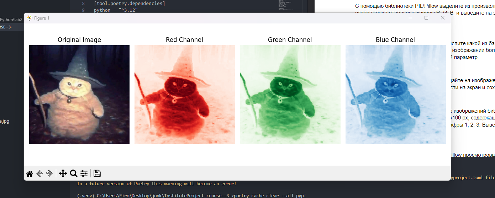
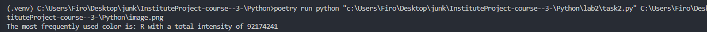
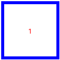
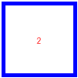
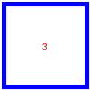
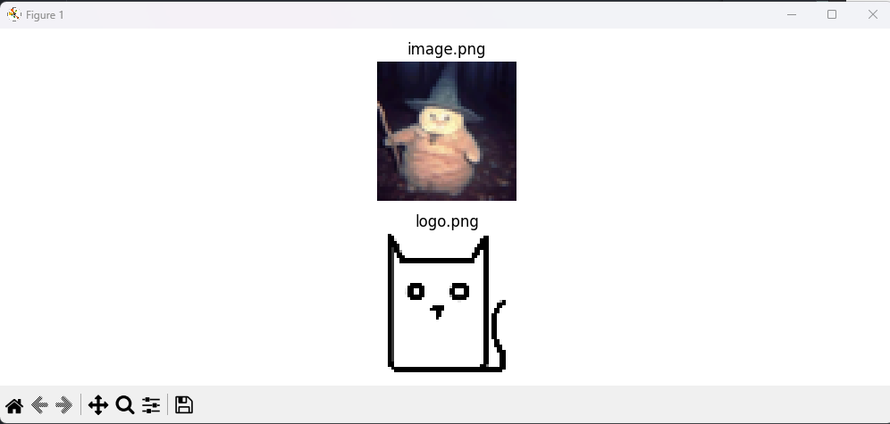

### Lab2
task1

task2

task3

task4

task 5 

`(.venv) C:\Users\Firo\Desktop\junk\InstituteProject-course--3-\Python>poetry run python "c:\Users\Firo\Desktop\junk\InstituteProject-course--3-\Python\lab2\task5.py" -ft png  `

