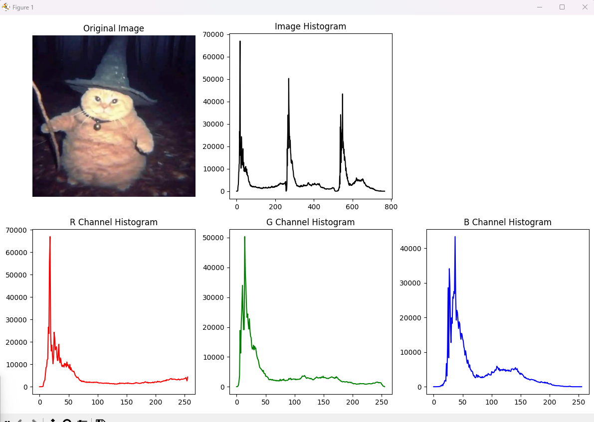

### Lab3
task1
```
parser.add_argument("input_file", type=str, help="Full path to the input video file")
    parser.add_argument("start_time", type=str, help="Start time of the clip (hh:mm:ss)")
    parser.add_argument("end_time", type=str, help="End time of the clip (hh:mm:ss)")
    parser.add_argument("output_file", type=str, help="Output video file name (will be saved in the same directory as the input file)")
```

example command:
```
(.venv) >poetry run python "c:\Users\Firo\Desktop\junk\InstituteProject-course--3-\Python\lab3\task1.py" C:\Users\Firo\Desktop\junk\InstituteProject-course--3-\Python\lab3\train\dirty --transforms rotate gaussian_noise   
```


архив path:
Python\lab3\train.7z

task2



