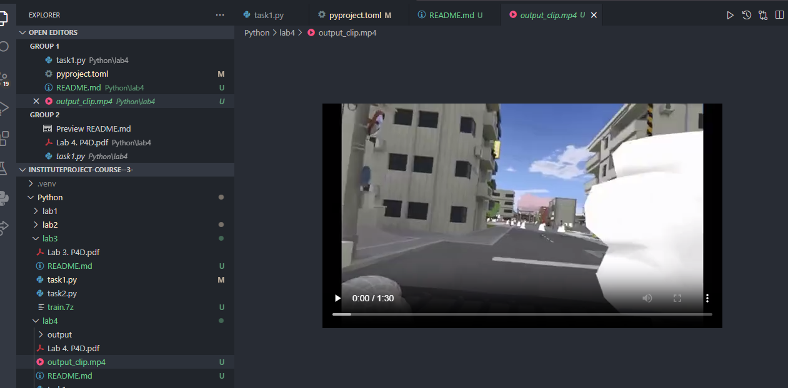
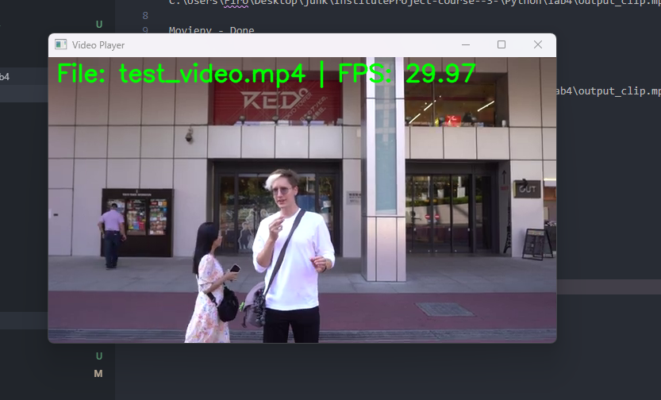

### Lab1
task1
```
>poetry run python "c:\Users\Firo\Desktop\junk\InstituteProject-course--3-\Python\lab4\task1.py" "C:\Users\Firo\Desktop\junk\InstituteProject-course--3-\Python\lab4\test_video.mp4" "00:01:00" "00:02:30" "output_clip.mp4"
```
```  
Moviepy - Building video C:\Users\Firo\Desktop\junk\InstituteProject-course--3-\Python\lab4\output_clip.mp4.
MoviePy - Writing audio in output_clipTEMP_MPY_wvf_snd.mp4
MoviePy - Done.                                                                                                                                                                                     
Moviepy - Writing video C:\Users\Firo\Desktop\junk\InstituteProject-course--3-\Python\lab4\output_clip.mp4

Moviepy - Done !                                                                                                                                                                                    
Moviepy - video ready C:\Users\Firo\Desktop\junk\InstituteProject-course--3-\Python\lab4\output_clip.mp4
```




task2
```
poetry run python "c:\Users\Firo\Desktop\junk\InstituteProject-course--3-\Python\lab4\task2.py" "C:\Users\Firo\Desktop\junk\InstituteProject-course--3-\Python\lab4\test_video.mp4" "00:01:00" "00:02:30" --step 10 
Saved C:\Users\Firo\Desktop\junk\InstituteProject-course--3-\Python\lab4\output\frame_0000.jpg
Saved C:\Users\Firo\Desktop\junk\InstituteProject-course--3-\Python\lab4\output\frame_0001.jpg
Saved C:\Users\Firo\Desktop\junk\InstituteProject-course--3-\Python\lab4\output\frame_0002.jpg
Saved C:\Users\Firo\Desktop\junk\InstituteProject-course--3-\Python\lab4\output\frame_0003.jpg
Saved C:\Users\Firo\Desktop\junk\InstituteProject-course--3-\Python\lab4\output\frame_0004.jpg
Saved C:\Users\Firo\Desktop\junk\InstituteProject-course--3-\Python\lab4\output\frame_0005.jpg
Saved C:\Users\Firo\Desktop\junk\InstituteProject-course--3-\Python\lab4\output\frame_0006.jpg
Saved C:\Users\Firo\Desktop\junk\InstituteProject-course--3-\Python\lab4\output\frame_0007.jpg
Saved C:\Users\Firo\Desktop\junk\InstituteProject-course--3-\Python\lab4\output\frame_0008.jpg
Extracted 9 frames to C:\Users\Firo\Desktop\junk\InstituteProject-course--3-\Python\lab4\output
```
check:
Python\lab4\output

task3

